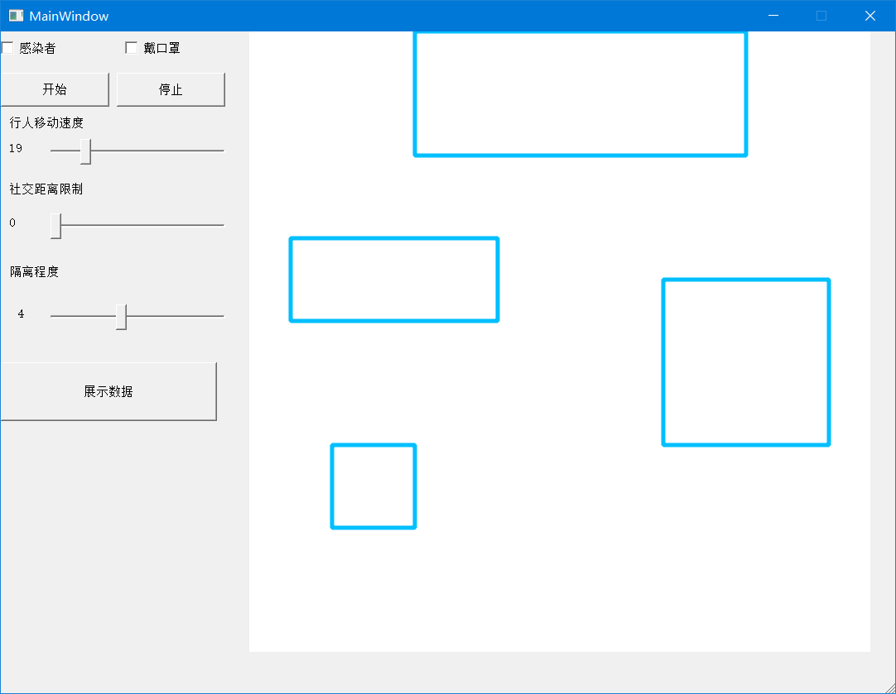
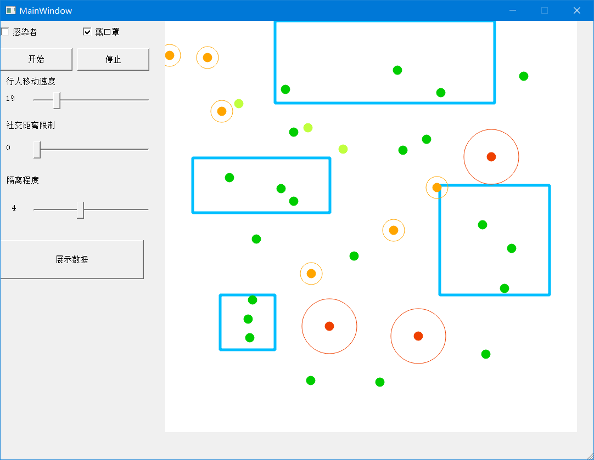
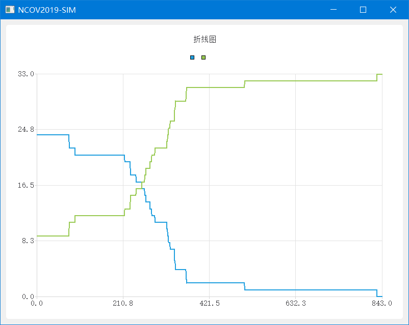

#  VirusInfectionSimulation

简单的病毒传染模拟

## 使用说明

在[release](https://github.com/hhhxiao/VirusInfectionSimulation/releases)中下载并双击运行，目前仅支持windows，其它平台请下载源码并重新编译。

打开后然后你可以看到如下的页面:

上图中左边是控制台

上面两个选框表示要添加的人的情况，分别有是否是感染者和是否戴口罩两种情况

- 感染者会随机感染它附近的人，不带口罩的感染者感染距离更大，戴口罩的感染者感染距离小
- 健康者可能会被附近的感染者感染，戴口罩的健康者被感染的概率小
- **行人移动速度**展示了在模拟的时候的行人移动的距离
- **社交距离限制**展示了在模拟的时候行人和别人保持的最小距离
- **隔离程度**表示了行人愿意进出建筑物的意愿，数值越大越不愿意进出建筑物体

右边是可视化区域，左键可视化区域可以添加新的人

- **红色**是没有戴口罩的感染者，其周围的红圈表示它的感染范围
- **橙色**是戴口罩的感染者，周围的橙圈表示其感染范围
- **黄绿色**是没有戴口罩的感染者
- **绿色**是戴口罩的感染者
- **蓝色**框是建筑物

点击**开始**可以开始模拟,点击**停止**可以停止模拟

如下图是一次模拟过程的截图

点击**展示数据**可以显示这段模拟的感染者和健康者的数量变化

下图是一次模拟过程的结果展示:

## 注意

- 传播距离，传染概率以及建筑如被硬编码到代码中，如要修改请重新编译
- 模拟的数据不会清空，要重新模拟只能先关闭整个程序然后重新开始
- 感染者不会透过建筑物进行感染
- 结果统计中横坐标是轮数，纵坐标是人数，绿线是感染者数量，蓝线是健康者数量
## License
MIT
